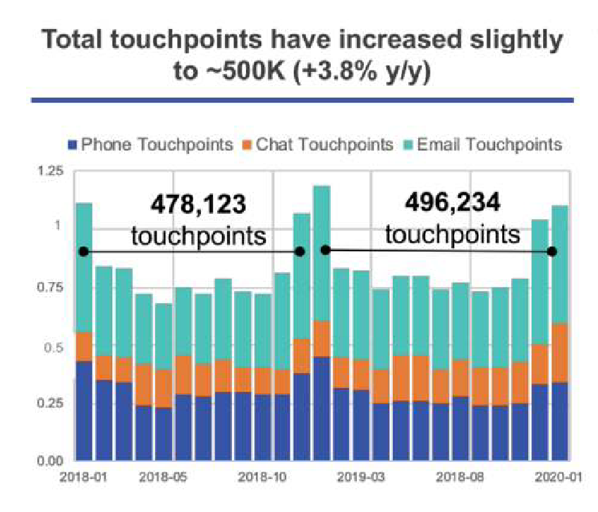
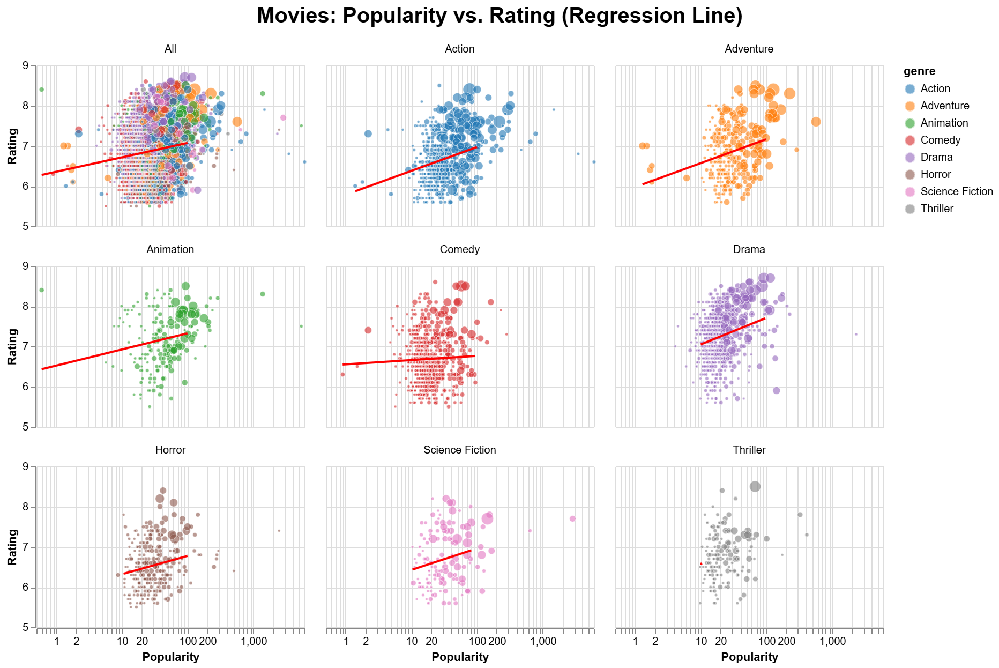

## Exercise 1: HW 4 revision

#### a. Scroll through the HW 4 Gallery to see the plots we created at that time. Find an example that has that has something you like about it and explain what you like.

**Comparing Twins:**
Nathan's idea of stacking the regional bars makes sense since the kits reports the percentages associated with world regions. However, it is quite confusing that for some people, the bars do not add up to 1.0. In this sense, it might be better to facet the bars like how Sunghun did.

**Comparing Kits:**
I like how Gayeon used lines to connect the points to show the differences between the kits.

#### b. Find an example that has somethng you don’t like, and explain what you don’t like about it.

**Comparing Twins:**
Gayeon, Madeline, and Zachary's plots are too wide that you have to scroll horizontally to see the full plot. Ponjul combined all the twins, when the purpose was to compare the twins.

**Comparing Kits:**
Nathan and Owen's plots only have three bars/box plots, which makes it confusing. Adding up all the percentages for the twins does not make sense because some twins may have negative differences and some others may have positive differences, summing up to be zero.

#### c. Now create two graphics, one that helps compare the kits and one that helps compare twins.

```{r}
library(vegawidget)

'
{
  "$schema": "https://vega.github.io/schema/vega-lite/v5.json",
  "title": {
    "text": "Genetic Share Comparison by Twin Pair",
    "fontSize": 20, "anchor": "middle", "offset": 15
  },
  "data": { "url": "https://calvin-data304.netlify.app/data/twins-genetics-long.json" },
  "vconcat": [
    {
      "columns": 3,
      "facet": {
        "field": "pair", "type": "nominal",
        "header": {"title": "Mean Genetic Share", "titleOrient": "left"}
      },
      "spec": {
        "width": 180, "height": 230,
        "layer": [
          {
            "mark": "bar",
            "encoding": {
              "x": {
                "field": "region", "type": "ordinal",
                "axis": {"labelAngle": -45},
                "title": null
              },
              "y": {
                "field": "genetic share", "type": "quantitative",
                "aggregate": "mean", "title": null
              },
              "color": {"field": "id", "type": "nominal", "legend": {"title": "Twin"}},
              "xOffset": {"field": "id", "scale": {"padding": 0.2}}
            }
          }
        ]
      }
    }
  ]
}' |> as_vegaspec()
```

```{r}
'
{
  "$schema": "https://vega.github.io/schema/vega-lite/v5.json",
  "title": {
    "text": "Genetic Share Comparison by Kit",
    "fontSize": 20, "anchor": "middle", "offset": 15
  },
  "data": {
    "url": "https://calvin-data304.netlify.app/data/twins-genetics-long.json"
  },
  "columns": 3,
  "facet": {
    "field": "pair",
    "type": "ordinal",
    "header": {"title": "Genetic Share", "titleOrient": "left"}
  },
  "spec": {
    "width": 180,
    "height": 230,
    "encoding": {
      "x": {
          "field": "region", "type": "ordinal",
          "axis": {"labelAngle": -45},
          "title": null
        },
      "y": {"field": "genetic share", "type": "quantitative", "title": null},
      "xOffset": {"field": "kit"},
      "color": {"field": "kit", "title": "Kit"}},
    "layer": [
      {
        "mark": {"type": "point", "shape": "circle", "filled": true, "size": 50, "opacity": 1,
        "tooltip": ["kit", "twin", "region", "genetic share"]}
      },
      {
        "mark": {"type": "rule", "size": 4, "opacity": 0.8},
        "encoding": {
          "y": {"field": "genetic share", "aggregate": "min"},
          "y2": {"field": "genetic share", "aggregate": "max"}
        }
      }
    ]
  }
}' |> as_vegaspec()
```

#### d. For each graphic, include a paragraph that tells the story of your graphic.

**Genetic Share Comparison by Twin Pair:**
The purpose of this graph is to verify how consistent the results are between genetically identical twins. Since displaying all the kits would distract the viewer, I used the average values from the three kits to eliminate this noise, and placed twins A and B side by side to maximize visual comparison. As shown in the graph, the regional genetic contributions match for most twin pairs. However, since there is a slight discrepancy especially for pair 1, this demonstrates that the genetic similarity between twins is not perfectly reflected in the test results.

**Genetic Share Comparison by Kit:**
This graph illustrates how results can vary depending on the analysis kit, even for identical twins. Instead of using standard bars, I overlaid a dot plot with a line connecting the dots to highlight the range and distribution of values provided by the three kits for the same individual. I also assigned different colors to each kit so that viewers can instantly identify them when looking at the graphic as a whole. Sections where the dots are widely spread vertically in specific regions (e.g., “SE Europe” in Pair 1’s MyHeritage result) suggest differences in the analysis algorithms or reference data used by each kit. This helps users understand that genetic test results are not absolute values, but rather subject to interpretation depending on the testing provider.

Limitation: I tried to add a tooltip to the dots; however, I couldn't figure out how to exclude the unnecessary labels even though I only listed out the wanted fields.

Other choice I made: I got rid of the "Regions" label because it is obvious.


## Exercise 2: Data and graphics challenge

#### Challenge #2: Customer Touchpoints
Context: Customer touchpoints (email, email, or chat) over time.

Data Source: [CSV](https://calvin-data304.netlify.app/data/swd-lets-practice-ex-5-03.csv), [Excel](https://calvin-data304.netlify.app/data/swd-lets-practice-ex-5-03.xlsx), (Knaflic 2020, p 206)]

This is the original graphic.

{width=60%}

- The X-axis is fundamentally flawed and out of chronological order (e.g., 2018-08 appearing after 2019-03). This makes it impossible to track actual growth or patterns.
- The Y-axis labels lack clear units. Without a defined scale (e.g., in hundreds of thousands), the numerical values are disconnected from the "500K" figure mentioned in the title, causing confusion.
- While the title emphasizes "total touchpoints," the use of a stacked bar chart obscures the individual trends of each method. The varying baselines make it nearly impossible to compare the 'squeezed' segments, defeating the purpose of showing all three categories.
- It is hard to understand what the black horizontal lines are trying to say.

```{r}
'{
  "$schema": "https://vega.github.io/schema/vega-lite/v5.json",
  "data": {"url": "https://calvin-data304.netlify.app/data/swd-lets-practice-ex-5-03.csv"},
  "title": {
    "text": "Shift in Customer Support Channels",
    "fontSize": 20, "anchor": "middle", "offset": 15
  },
  "transform": [
    {
      "calculate": "toNumber(datum[\'Phone Touchpoints\']) + toNumber(datum[\'Chat Touchpoints\']) + toNumber(datum[\'Email Touchpoints\'])",
      "as": "Total"
    },
    {
      "fold": ["Phone Touchpoints", "Chat Touchpoints", "Email Touchpoints"],
      "as": ["channel", "touchpoint"]
    },
    {
      "calculate": "replace(datum.channel, \' Touchpoints\', \'\')",
      "as": "short_channel"
    }
  ],
  "width": 500,
  "height": 300,
  "layer": [
    {
      "mark": {
        "type": "text",
        "text": "Total Touchpoints",
        "x": 340,
        "y": 85,
        "align": "left",
        "baseline": "middle",
        "color": "black",
        "size": 14
      }
    },
    {
      "mark": {"type": "line", "point": true, "tooltip": true},
      "encoding": {
        "x": {"field": "Date", "type": "temporal", "axis": {"labelAngle": -45, "format": "%Y-%m"}},
        "y": {
          "field": "touchpoint", 
          "type": "quantitative", 
          "title": "Touchpoints (100K)"
        },
        "color": {
          "field": "channel", 
          "type": "nominal", 
          "scale": {"range": ["#4c78a8", "#f58518", "#e45756"]}
        }
      }
    },
    {
      "mark": {"type": "line", "point": false, "strokeWidth": 4, "color": "black", "tooltip": true},
      "encoding": {
        "x": {"field": "Date", "type": "temporal"},
        "y": {"field": "Total", "type": "quantitative"}
      }
    },
    {
      "mark": {"type": "text", "align": "left", "dx": 260, "fontWeight": "bold"},
      "transform": [
        {"filter": "datum.Date >= datetime(2019, 11, 1)"}
      ],
      "encoding": {
        "y": {"field": "touchpoint", "type": "quantitative"},
        "text": {"field": "short_channel", "type": "nominal"},
        "color": {
          "field": "channel", 
          "type": "nominal", 
          "legend": null,
          "scale": {"range": ["#4c78a8", "#f58518", "#e45756"]}
        }
      }
    }
  ]
}' |> as_vegaspec()
```


## Exercise 3: A new challenge

```{r}
'{
  "$schema": "https://vega.github.io/schema/vega-lite/v5.json",
  "data": {
    "values": [
      {"Year": "2015-2016", "TFR": 5.2, "Contraception": 38.4, "Unmet": 22.1},
      {"Year": "2010", "TFR": 5.4, "Contraception": 23.6, "Unmet": 22.3},
      {"Year": "2004-2005", "TFR": 5.7, "Contraception": 17.6, "Unmet": 24.3},
      {"Year": "1999", "TFR": 5.6, "Contraception": 15.6, "Unmet": 22.3},
      {"Year": "1996", "TFR": 5.8, "Contraception": 11.7, "Unmet": 26.0},
      {"Year": "1991-1992", "TFR": 6.2, "Contraception": 5.9, "Unmet": 27.8}
    ]
  },
  "title": {
    "text": "Tanzania: Family Planning Trends vs. Fertility Rate",
    "fontSize": 20,
    "anchor": "middle",
    "offset": 15
  },
  "transform": [
    {
      "calculate": "indexof(datum[\'Year\'], \'-\') > 0 ? (toNumber(split(datum[\'Year\'], \'-\')[0]) + toNumber(split(datum[\'Year\'], \'-\')[1])) / 2 : toNumber(datum[\'Year\'])",
      "as": "mid_year"
    }
  ],
  "width": 600,
  "height": 350,
  "layer": [
    {
      "name": "PERCENTAGE_GROUP",
      "encoding": {
        "x": {
          "field": "mid_year",
          "type": "quantitative",
          "scale": {"domain": [1980, 2020]},
          "axis": {"format": "d", "title": "Survey Year", "grid": true, "tickMinStep": 1, "values": [ 1991, 1995, 1999, 2003, 2007, 2011, 2015, 2019]}
        },
        "y": {
          "type": "quantitative",
          "scale": {"domain": [0, 45]},
          "axis": {"orient": "left", "title": "Percentage (%)", "titleColor": "black"}
        }
      },
      "layer": [
        {"mark": {"type": "line", "color": "black", "strokeDash": [5, 5], "tooltip": true}, "encoding": {"y": {"field": "Unmet"}}},
        {"mark": {"type": "line", "color": "black", "tooltip": true}, "encoding": {"y": {"field": "Contraception"}}},
        {
          "mark": {"type": "text", "align": "right", "dx": -12},
          "transform": [{"filter": "datum.mid_year == 1991.5"}],
          "encoding": {"y": {"field": "Unmet"}, "text": {"value": ["Unmet Need", "for Family Planning","(%)"]}, "color": {"value": "black"}}
        },
        {
          "mark": {"type": "text", "align": "right", "dx": -12, "fontWeight": "bold"},
          "transform": [{"filter": "datum.mid_year == 1991.5"}],
          "encoding": {"y": {"field": "Contraception"}, "text": {"value": ["Current Use of","Modern Contraception","(%)"]}, "color": {"value": "black"}}
        }
      ]
    },
    {
      "name": "TFR_GROUP",
      "encoding": {
        "x": {"field": "mid_year", "type": "quantitative"},
        "y": {
          "field": "TFR",
          "type": "quantitative",
          "scale": {"domain": [0, 9]},
          "axis": {"orient": "right", "title": "TFR (# of Children)", "titleColor": "blue"}
        }
      },
      "layer": [
        {"mark": {"type": "line", "color": "blue", "strokeWidth": 4, "tooltip": true}},
        {
          "mark": {"type": "text", "align": "right", "dx": -12, "dy": -10, "fontWeight": "bold"},
          "transform": [{"filter": "datum.mid_year == 1991.5"}],
          "encoding": {"text": {"value": ["Total Fertility Rate","(All Women Ages 15-49)"]}, "color": {"value": "blue"}}
        }
      ]
    }
  ],
  "resolve": {"scale": {"y": "independent"}}
}' |> as_vegaspec()
```

This visualization illustrates a clear inverse correlation between the adoption of modern contraception and the total fertility rate in Tanzania since the early 1990s. As the use of modern contraceptive methods surged from approximately 6% to nearly 40%, the average number of children per woman (TFR) saw a steady decline from 6.2 to 5.2. Interestingly, while "Unmet Need for Family Planning" has decreased slightly over the decades, it remains relatively stagnant at around 22%, suggesting that despite significant progress in contraceptive access, a substantial gap in reproductive healthcare services persists.


## Exercise 4: Your masterpiece

For this exercise, I chose to explore the relationship between popularity and ratings of movies. My initial question was "Are the most-watched movies also the best-rated?"

To do this, I found a data set from kaggle: [TMDB 5000 Movie Dataset](https://www.kaggle.com/datasets/yashkmd/top-rated-movies/data)

Some data wrangling steps I took:

- 5000 movies were too much to handle, so I only left the movies with at least 1000 voting counts.
- Genres were specified as ID numbers. I looked up the decoding of them and replaced the numbers into the actual name of the genre. Some of the movies had more than one genre. For these movies, I only left one that comes the first.
- Since the data set was too big, I got rid of the columns except for the title, popularity, vote_average, vote_count, and genre.
- Popularity and vote_average were rounded to the nearest tenth.

I used AI(Gemini) to write the python code for this wrangling step.

```{r}
library(tidyverse)

movies <- read.csv("https://raw.githubusercontent.com/hjyi01/others/refs/heads/main/movies_lite.csv") %>% arrange(title)

head(movies)
```


```{r}
'{
  "$schema": "https://vega.github.io/schema/vega-lite/v5.json",
  "title": {
    "text": "Movies: Popularity vs. Rating (by Genre)",
    "fontSize": 20, "anchor": "middle", "offset": 15
  },
  "data": {
    "url": "https://raw.githubusercontent.com/hjyi01/others/refs/heads/main/movies_lite.csv"
  },
  "width": 600,
  "height": 300,
  "params": [
    {
      "name": "genre_var",
      "value": "All",
      "bind": {
        "input": "select",
        "options": ["All", "Action", "Adventure", "Animation", "Comedy", "Drama", "Horror", "Science Fiction", "Thriller"],
        "name": "Select Genre: "
      }
    },
    {
      "name": "highlight",
      "value": false,
      "bind": {"input": "checkbox", "name": "Highlight Top-Rated Movies: "}
    }
  ],
  "transform": [
    {
      "filter": "indexof([\'Action\', \'Adventure\', \'Animation\', \'Comedy\', \'Drama\', \'Horror\', \'Science Fiction\', \'Thriller\'], datum.genre) !== -1"
    },
    {"filter": "genre_var === \'All\' || datum.genre === genre_var"},
    {
      "window": [{"op": "row_number", "as": "r_desc"}],
      "sort": [{"field": "vote_average", "order": "descending"}]
    },
    {
      "calculate": "datum.r_desc <= 5",
      "as": "top_5"
    }
  ],
  "layer": [
    {
      "name": "main_dots",
      "mark": {"type": "circle", "filled": true},
      "encoding": {
        "x": {
          "field": "popularity",
          "type": "quantitative",
          "scale": {"type": "log", "domain": [0.5, 6000], "nice": false},
          "title": "Popularity (Log Scale)"
        },
        "y": {
          "field": "vote_average",
          "type": "quantitative",
          "scale": {"domain": [5.4, 8.9]},
          "title": "Rating (0-10)"
        },
        "size": {
          "field": "vote_count",
          "type": "quantitative",
          "scale": {"range": [1, 200], "domain": [1000, 30000]},
          "title": "Vote Count"
        },
        "color": {
          "field": "genre",
          "type": "nominal",
          "scale": {
            "scheme": "category10",
            "domain": ["Action", "Adventure", "Animation", "Comedy", "Drama", "Horror", "Science Fiction", "Thriller"]
          },
          "title": "Genre"
        },
        "opacity": {
          "condition": {"test": "!highlight || datum.top_5", "value": 0.5},
          "value": 0.05
        },
        "order": {
          "field": "vote_count",
          "type": "quantitative",
          "sort": "descending"
        },
        "tooltip": [
          {"field": "title", "title": "Movie"},
          {"field": "vote_average", "title": "Rating"},
          {"field": "vote_count", "title": "Vote Count"},
          {"field": "popularity", "title": "Popularity"},
          {"field": "top_5", "title": "Top 5"}
        ]
      }
    }
  ]
}' |> as_vegaspec()
```

#### Explaining my choices

- I chose scatter plot because I thought it was the easiest way to show the distribution of many dots across rating as y-axis and popularity as x-axis.
- I used logarithmic scale for the popularity because they were very clustered.
- Color is mapped to genre, and size is mapped to vote count. I thought it would be interesting to see the distribution by genre, so I added an interactive dropdown to select a genre.
- I also added a checkbox that highlights the top-5 rated movies for the selected genre.
- Tooltip shows up when you hover on a point.

#### Alternatives?

I wanted to see the compare the distribution by genre by laying them out side by side.

```{r}
'
{
  "$schema": "https://vega.github.io/schema/vega-lite/v5.json",
  "data": {
    "url": "https://raw.githubusercontent.com/hjyi01/others/refs/heads/main/movies_lite.csv"
  },
  "title": {
    "text": "Movies: Popularity vs. Rating (Regression Line)",
    "fontSize": 20, "anchor": "middle", "offset": 15
  },
  "transform": [
    {
      "filter": "indexof([\'Action\', \'Adventure\', \'Animation\', \'Comedy\', \'Drama\', \'Horror\', \'Science Fiction\', \'Thriller\'], datum.genre) !== -1"
    },
    {"calculate": "[\'All\', datum.genre]", "as": "genre_facet"},
    {"flatten": ["genre_facet"]}
  ],
  "columns": 3,
  "facet": {
    "field": "genre_facet",
    "type": "nominal",
    "title": null,
    "sort": ["All", "Action", "Adventure", "Animation", "Comedy", "Drama", "Horror", "Science Fiction", "Thriller"]
  },
  "spec": {
    "width": 250,
    "height": 150,
    "layer": [
      {
        "name": "main_dots",
        "mark": {"type": "circle", "filled": true, "stroke": "white", "strokeWidth": 0.5, "opacity": 0.6},
        "encoding": {
          "x": {
            "field": "popularity",
            "type": "quantitative",
            "scale": {"type": "log", "domain": [0.5, 6000]},
            "title": "Popularity"
          },
          "y": {
            "field": "vote_average",
            "type": "quantitative",
            "scale": {"domain": [5.4, 9]},
            "axis": {"title": "Rating"}
          },
          "size": {
            "field": "vote_count",
            "type": "quantitative",
            "scale": {"range": [1, 150]},
            "legend": null
          },
          "color": {
            "field": "genre",
            "type": "nominal",
            "scale": {
              "scheme": "category10",
              "domain": ["Action", "Adventure", "Animation", "Comedy", "Drama", "Horror", "Science Fiction", "Thriller"]
            }
          }
        }
      },
      {
        "name": "regression_line",
        "transform": [
          {
            "regression": "vote_average",
            "on": "popularity",
            "method": "log",
            "groupby": ["genre_facet"]
          }
        ],
        "mark": {"type": "line", "color": "red", "size": 3},
        "encoding": {
          "x": {"field": "popularity", "type": "quantitative"},
          "y": {"field": "vote_average", "type": "quantitative"}
        }
      }
    ]
  },
  "config": {
    "facet": {"spacing": 15},
    "view": {"stroke": "transparent"}
  }
}
' |> vegawidget::as_vegaspec()
```

I also added a regression line; it worked on vega lite but the lines aren't showing up after rendering to html so I am including a png:


In this, I could see that "Comedy" has a flatter line, showing that ratings are not strongly correlated with popularity.

It was also interesting to see that movies that fall under "Drama" or "Animation" tend to have high ratings than other genres.

Since the points are very clustered, it is difficult to hover on the exact point I want to look at. Because of this, I wanted to include a zoom-in/out. However, I couldn't get that far due to time constraints.

## Exercise 5: Using your palette

#### a. an encoding channel other than x or y.

- Exercises 1(color, xOffset), 2(color), 3(text), 4(size, color, opacity, order, tooltip)

#### b. layers

- Exercises 1-4

#### c. facets

- Exercise 1

#### d. concatenation or repeat

- Exercise 1(vConcat)

#### e. non-default settings for a channel’s scale or guide

- Exercises 2(color codes), 3(domain of axes), 4(log, color scheme, domain and range of axes )

#### f. tooltips

- Exercises 1-4

#### g. another kind of interaction (panning/zooming, brushing, sliders, etc.)

- Exercise 4(dropdown, checkbox)

## Exercise 6: Keep learning

#### a. Features of Vega-Lite that we did not learn in class

- labelAngle - [Axis](https://vega.github.io/vega-lite/docs/axis.html#:~:text=current%20axis%20orientation.-,labelAngle,-Number%20%7C%20ExprRef)

- anchor - [Title](https://vega.github.io/vega-lite/docs/title.html)

- window in transform - [Window](https://vega.github.io/vega-lite/docs/window.html)

#### b. Principles of good graphics design

- Exercise 1: Genetic Share Comparison by Kit (second graphic) - Graph the difference (e.g., plotting the Unmet Demand (Demand minus Capacity)) [Knaflic, p.74](https://files.myopenmath.com/cfiles/317877/StorytellingwithDataLetsPracticebyColeNussbaumerKnaflic-chapter2.pdf) *This is the author's least favorite in the example because too much context is omitted.

- Exercise 2: direct labeling - 20.2 Designing figures without legends [Wilke](https://clauswilke.com/dataviz/redundant-coding.html#designing-legends-with-redundant-coding)


