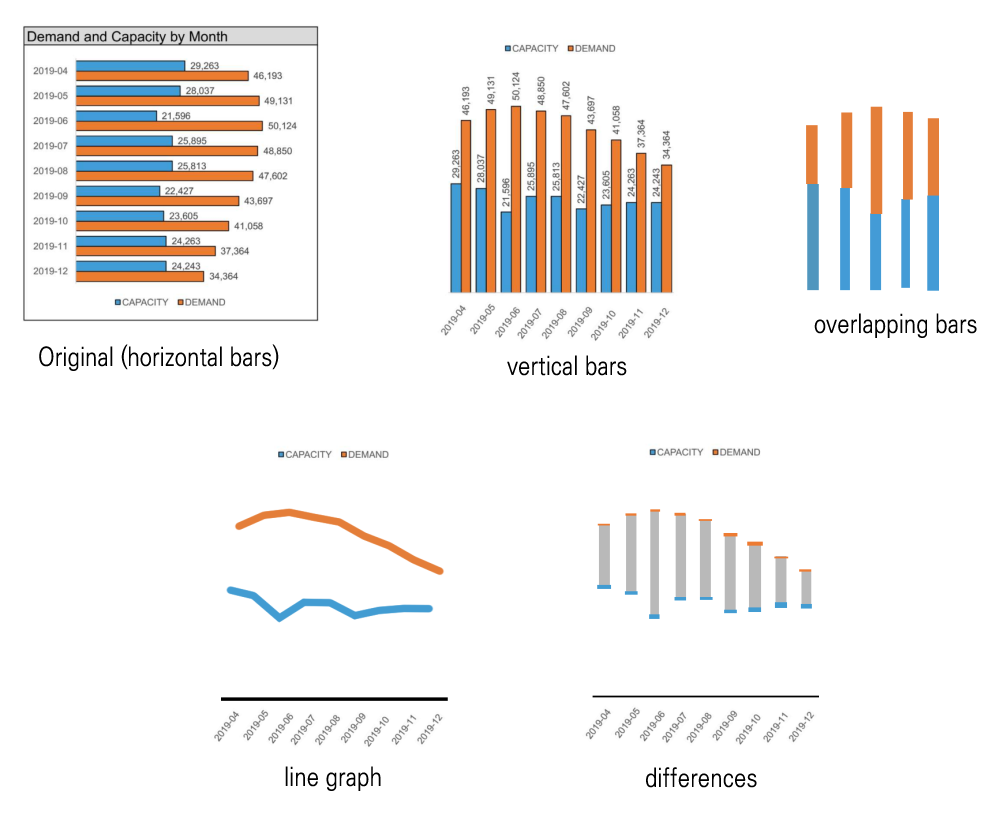

# Reading, Drawing, and Vega-Lite

## Exercise 2



## Exercise 3
All four of the sketches I made are included on page 69. The book had more ideas such as the stacked bars with different width and the plot of unmet demands.

I like the penultimate view the most. It emphasizes the differences between the demand and the capacity while also showing the dotted plots of each.

## Exercise 4
I can make the bar charts that lay out the demand and capacity side-by-side or stacked. I also know how to make the line graphs.

For the middle left, I don't know how to change the width of capacity and overlay it on top of demand.

For the bottom left, I can make dotted plots, but wouldn't be able to draw the bars (or lines) that connect the demand dots and capacity dots.

## Exercise 5
```{r}
library(vegawidget)

'
{
  "$schema": "https://vega.github.io/schema/vega-lite/v5.json",
  "data": {
    "url": "https://calvin-data304.netlify.app/data/swd-lets-practice-ex-2-3.json"
  },
  "transform": [
    { "calculate": "datum.demand - datum.capacity", "as": "unmet_demand"}
  ],
  "width": 500,
  "height": 150,
  "mark": "line",
  "encoding": {
    "x": {
      "field": "date",
      "type": "nominal",
      "title": "Date"
    },
    "y": {
      "field": "unmet_demand", 
      "type": "quantitative",
      "title": "Unmet Demand"
    }
  }
}' |> as_vegaspec()
```


## Exercise 6

(a) draw attention to similarities/differences between twins
```{r}
'
{
  "$schema": "https://vega.github.io/schema/vega-lite/v5.json",
  "data": {
    "url": "https://calvin-data304.netlify.app/data/twins-genetics-long.json"
  },
  "width": 250,
  "height": 300,
  "mark": "point",
  "encoding": {
    "x": {
      "field": "pair",
      "type": "nominal"
    },
    "y": {
      "field": "genetic share",
      "type": "quantitative"
    },
      "color": {"field": "kit", "type": "nominal"},
    "column": {"field": "id", "type": "nominal"}
  }
}' |> as_vegaspec()
```


(b) draw attention to similarities/differences between DNA kits
```{r}
'
{
  "$schema": "https://vega.github.io/schema/vega-lite/v5.json",
  "data": {
    "url": "https://calvin-data304.netlify.app/data/twins-genetics-long.json"
  },
  "width": 50,
  "height": 200,
  "mark": "point",
  "encoding": {
    "x": {
      "field": "kit",
      "type": "nominal"
    },
    "y": {
      "field": "genetic share",
      "type": "quantitative"
    },
    "color": {"field": "region", "type": "nominal"},
    "column": {"field": "pair", "type": "nominal"},
    "row": {"field": "id", "type": "nominal"}
  }
}' |> as_vegaspec()
```


## Exercise 6

#### QUESTION 1: What do you like about each graph? What can you easily see or compare?

Option A - The pie adds up to a circle, which is intuitive thinking that the numbers are percentages.

Option B - It's easy to compare the height of the bars since they are right next to each other. Also, the bars are colored easily showing which year it's from.

Option C - The bars are centered at the response "Agree," which makes it easy to look at the trend.

Option D - The differences are easily conceivable looking at the slopes.

#### QUESTION 2: What is difficult about the given view? Are there limitations or other considerations of which to be aware?

Option A - Pies are hard to compare since human eyes have trouble finding differences between shapes when they're at different angles.

Option B - You have to make the comparison from left to right, looking at them one by one.

Option C - It is very hard to compare the "Strongly Disagree" portion without looking at the text.

Option D - Since they don't stack, it is hard to know how the responses adds up.

#### QUESTION 3: If you were tasked with communicating this data, which option would you choose and why?

Since want to show how employees responded this year compared to last year to the retention item, I want to emphasize the comparison between this year and last year. Option D does the best job demonstrating this comparison. It directly shows the difference using the slope connecting two points.

#### QUESTION 4: Grab a friend or colleague and talk through the various options together. Do they agree with your preferred view, or is there a preference for another? Did your discussion highlight anything interesting that you hadn’t previously considered?

My friend said they prefer Option C because it is easier to understand the overall trend of what proportion of people responded positively or negatively.